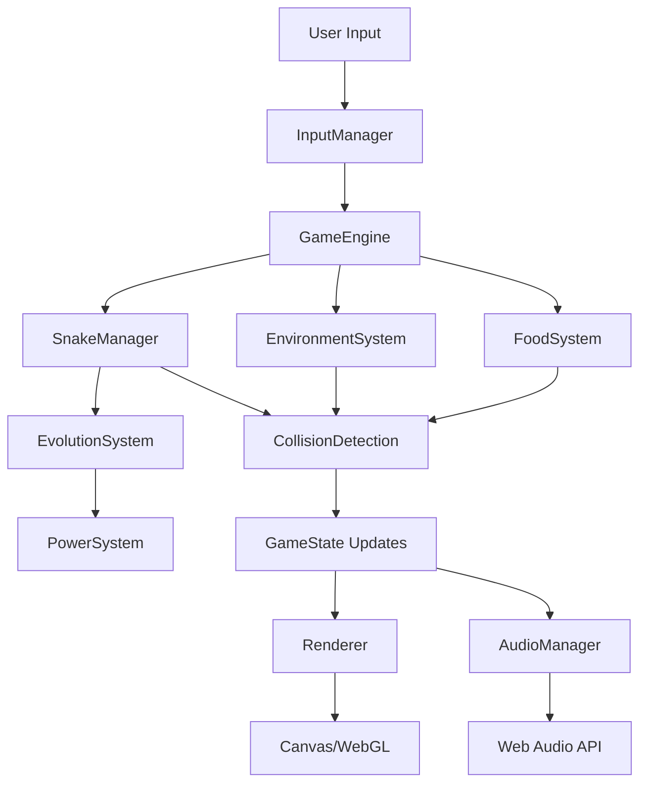

# Design Document

## Overview

The Ouroboros Snake Game is a sophisticated web-based evolution of the classic snake game, featuring a 10-level progression system with unique abilities, environmental interactions, and premium visual effects. The game combines smooth 60 FPS gameplay with strategic depth through evolution-based powers and environmental obstacles.

The architecture follows a modular design pattern with clear separation of concerns: game engine, rendering system, evolution manager, environmental system, and audio manager. The game uses HTML5 Canvas with WebGL for high-performance graphics and Web Audio API for dynamic sound.

## Architecture

### Core System Architecture

```
┌─────────────────────────────────────────────────────────────┐
│                    Game Application                         │
├─────────────────────────────────────────────────────────────┤
│  UI Layer (React Components)                               │
│  ├── GameCanvas                                            │
│  ├── HUD (Score, Evolution Level, Power Cooldowns)         │
│  ├── MainMenu                                              │
│  └── GameOverScreen                                        │
├─────────────────────────────────────────────────────────────┤
│  Game Engine Core                                          │
│  ├── GameLoop (60 FPS)                                     │
│  ├── InputManager (WASD/Arrow Keys)                        │
│  ├── StateManager (Playing/Paused/GameOver)                │
│  └── CollisionDetection                                    │
├─────────────────────────────────────────────────────────────┤
│  Game Systems                                              │
│  ├── SnakeManager                                          │
│  ├── EvolutionSystem                                       │
│  ├── FoodSystem                                            │
│  ├── EnvironmentSystem                                     │
│  ├── PowerSystem                                           │
│  └── ScoreSystem                                           │
├─────────────────────────────────────────────────────────────┤
│  Rendering Engine                                          │
│  ├── WebGL Renderer                                        │
│  ├── ParticleSystem                                        │
│  ├── AnimationManager                                      │
│  ├── LightingSystem                                        │
│  └── EffectsManager                                        │
├─────────────────────────────────────────────────────────────┤
│  Audio System                                              │
│  ├── SoundManager (Web Audio API)                          │
│  ├── MusicManager                                          │
│  └── EffectAudioPool                                       │
└─────────────────────────────────────────────────────────────┘
```

### Data Flow Architecture



## Components and Interfaces

### Snake Management System

**SnakeManager Class**
```typescript
interface SnakeSegment {
  x: number;
  y: number;
  rotation: number;
  scale: number;
}

interface SnakeState {
  segments: SnakeSegment[];
  head: SnakeSegment;
  direction: Vector2;
  speed: number;
  evolutionLevel: number;
  isAlive: boolean;
  powers: PowerState[];
}

class SnakeManager {
  private snake: SnakeState;
  private movementQueue: Vector2[];
  
  public update(deltaTime: number): void;
  public move(): void;
  public grow(segments: number): void;
  public checkSelfCollision(): boolean;
  public getHeadPosition(): Vector2;
  public consumeTail(segments: number): void; // Ouroboros ability
}
```

**Movement System**
- Smooth interpolation between grid positions
- Curved turning using Bézier curves for natural snake movement
- Segment following with slight delay for realistic body physics
- Direction queuing to prevent rapid direction changes

### Evolution System

**EvolutionManager Class**
```typescript
interface EvolutionLevel {
  id: number;
  name: string;
  requiredFood: number;
  segmentCount: number;
  visualPattern: VisualPattern;
  powers: PowerType[];
  specialAbilities: SpecialAbility[];
}

interface PowerState {
  type: PowerType;
  isActive: boolean;
  cooldownRemaining: number;
  duration: number;
}

class EvolutionSystem {
  private currentLevel: number;
  private foodProgress: number;
  private evolutionLevels: EvolutionLevel[];
  
  public checkEvolution(foodConsumed: FoodType): boolean;
  public triggerEvolution(): void;
  public getAvailablePowers(): PowerType[];
  public activatePower(powerType: PowerType): boolean;
}
```

**Evolution Progression**
- Automatic evolution triggers based on appropriate food consumption
- Visual transformation sequences with particle effects
- Power unlocking and ability inheritance system
- Size scaling and visual pattern updates

### Environmental System

**EnvironmentManager Class**
```typescript
interface Obstacle {
  type: ObstacleType;
  position: Vector2;
  size: Vector2;
  isDestructible: boolean;
  requiredPower?: PowerType;
  isActive: boolean;
}

interface DynamicElement {
  type: ElementType;
  position: Vector2;
  movementPattern?: MovementPattern;
  triggerCondition?: TriggerCondition;
  damage: number;
}

class EnvironmentSystem {
  private staticObstacles: Obstacle[];
  private dynamicElements: DynamicElement[];
  private interactiveFeatures: InteractiveFeature[];
  
  public generateLevel(): void;
  public updateDynamicElements(deltaTime: number): void;
  public checkObstacleInteraction(snakePosition: Vector2, power: PowerType): InteractionResult;
  public activateInteractiveFeature(feature: InteractiveFeature, trigger: any): void;
}
```

**Obstacle Types and Interactions**
- Static: Stone pillars, crystal formations, ice walls, thorn bushes, magic barriers
- Dynamic: Water pools, flame geysers, moving stone blocks, poison gas clouds, lightning strikes
- Interactive: Pressure plates, ancient switches, mystical portals
- Power-specific destruction and interaction logic

### Food System

**FoodManager Class**
```typescript
interface Food {
  type: FoodType;
  position: Vector2;
  evolutionLevel: number;
  points: number;
  effects: FoodEffect[];
  spawnTime: number;
  isSpecial: boolean;
}

interface FoodEffect {
  type: EffectType;
  duration: number;
  magnitude: number;
}

class FoodSystem {
  private activeFoods: Food[];
  private spawnTimer: number;
  private spawnRates: Map<FoodType, number>;
  
  public spawnFood(): void;
  public consumeFood(food: Food, snakeLevel: number): ConsumptionResult;
  public checkFoodCombinations(recentFoods: FoodType[]): BonusMultiplier;
  public applyNegativeEffects(effect: FoodEffect): void;
}
```

**Food Spawning Logic**
- 3-6 simultaneous food items with level-appropriate distribution
- Higher-tier foods spawn less frequently
- Special combination bonuses for strategic consumption
- Negative effects for consuming inappropriate evolution-level foods

### Power System

**PowerManager Class**
```typescript
interface Power {
  type: PowerType;
  cooldown: number;
  duration: number;
  visualEffect: EffectType;
  audioEffect: AudioClip;
  environmentalInteractions: InteractionType[];
}

class PowerSystem {
  private activePowers: Map<PowerType, PowerState>;
  private powerDefinitions: Map<PowerType, Power>;
  
  public activatePower(powerType: PowerType): boolean;
  public updatePowers(deltaTime: number): void;
  public checkEnvironmentalInteraction(power: PowerType, obstacle: Obstacle): boolean;
  public getVisualEffects(): VisualEffect[];
}
```

**Power Implementation Details**
- Fire Breath: Ray-casting for obstacle destruction with particle effects
- Time Warp: Global time scaling with visual distortion effects
- Invisibility: Alpha blending with shimmer particle overlay
- Aquatic Movement: Collision layer switching for water traversal
- Tail Consumption: Strategic segment removal with mystical effects

## Data Models

### Core Game State

```typescript
interface GameState {
  snake: SnakeState;
  evolution: EvolutionState;
  environment: EnvironmentState;
  food: FoodState;
  score: ScoreState;
  audio: AudioState;
  rendering: RenderState;
}

interface EvolutionState {
  currentLevel: number;
  foodProgress: number;
  availablePowers: PowerType[];
  activePowers: PowerState[];
  transformationInProgress: boolean;
}

interface EnvironmentState {
  currentLevel: number;
  obstacles: Obstacle[];
  dynamicElements: DynamicElement[];
  interactiveFeatures: InteractiveFeature[];
  weatherEffects: WeatherEffect[];
}
```

### Visual Data Models

```typescript
interface VisualPattern {
  baseColor: Color;
  secondaryColor: Color;
  patternType: PatternType;
  glowIntensity: number;
  scaleTexture: TextureId;
  animationSpeed: number;
}

interface ParticleEffect {
  type: ParticleType;
  position: Vector2;
  velocity: Vector2;
  lifetime: number;
  color: Color;
  size: number;
  fadeRate: number;
}
```

### Audio Data Models

```typescript
interface AudioClip {
  id: string;
  buffer: AudioBuffer;
  volume: number;
  pitch: number;
  loop: boolean;
}

interface SpatialAudio {
  position: Vector2;
  falloffDistance: number;
  volume: number;
}
```

## Error Handling

### Game State Recovery

**Error Boundaries**
- React error boundaries for UI component failures
- Game state validation and recovery mechanisms
- Graceful degradation for WebGL/audio failures
- Automatic save state restoration on crash recovery

**Collision Detection Errors**
```typescript
class CollisionSystem {
  public safeCollisionCheck(a: Collider, b: Collider): CollisionResult {
    try {
      return this.performCollisionCheck(a, b);
    } catch (error) {
      console.warn('Collision detection error:', error);
      return { hasCollision: false, point: null };
    }
  }
}
```

**Resource Loading Failures**
- Progressive asset loading with fallbacks
- Texture loading error handling with placeholder assets
- Audio loading failures with silent fallbacks
- Font loading errors with system font fallbacks

### Performance Error Handling

**Frame Rate Management**
```typescript
class GameLoop {
  private frameDropCount = 0;
  private readonly MAX_FRAME_DROPS = 5;
  
  public update(deltaTime: number): void {
    if (deltaTime > 33) { // More than 30 FPS drop
      this.frameDropCount++;
      if (this.frameDropCount > this.MAX_FRAME_DROPS) {
        this.reduceGraphicsQuality();
        this.frameDropCount = 0;
      }
    }
  }
}
```

**Memory Management**
- Particle system pooling to prevent memory leaks
- Texture atlas management for efficient GPU memory usage
- Audio buffer cleanup for unused sound effects
- Garbage collection optimization for smooth gameplay

## Testing Strategy

### Unit Testing

**Core Game Logic Tests**
```typescript
describe('SnakeManager', () => {
  test('should grow snake when consuming appropriate food', () => {
    const snake = new SnakeManager();
    const initialLength = snake.getLength();
    snake.consumeFood(FoodType.BasicBerry);
    expect(snake.getLength()).toBe(initialLength + 1);
  });
  
  test('should trigger evolution at correct food thresholds', () => {
    const evolution = new EvolutionSystem();
    evolution.addFoodProgress(FoodType.BasicBerry, 10);
    expect(evolution.shouldEvolve()).toBe(true);
  });
});
```

**Power System Tests**
```typescript
describe('PowerSystem', () => {
  test('Fire Breath should destroy destructible obstacles', () => {
    const powerSystem = new PowerSystem();
    const obstacle = new Obstacle(ObstacleType.IceWall, true);
    const result = powerSystem.activatePower(PowerType.FireBreath, obstacle);
    expect(result.obstacleDestroyed).toBe(true);
  });
});
```

### Integration Testing

**Game Flow Tests**
- Complete evolution progression from Hatchling to Ouroboros
- Environmental interaction testing for all power combinations
- Food system integration with evolution progression
- Audio-visual synchronization testing

**Performance Tests**
- 60 FPS maintenance under maximum particle load
- Memory usage stability during extended gameplay
- WebGL rendering performance with complex lighting
- Audio latency and synchronization testing

### Visual Testing

**Rendering Tests**
- Snake movement smoothness and curve accuracy
- Particle effect performance and visual quality
- Lighting system accuracy for different evolution levels
- UI responsiveness across different screen sizes

**Animation Tests**
- Evolution transformation sequence completeness
- Power activation visual effects accuracy
- Environmental destruction animations
- Tail consumption mystical effects

### User Experience Testing

**Gameplay Flow**
- Control responsiveness and input lag measurement
- Evolution progression pacing and satisfaction
- Environmental challenge difficulty curve
- Power usage strategic depth evaluation

**Accessibility Testing**
- Color contrast for different evolution patterns
- Audio cue clarity for visually impaired players
- Keyboard navigation completeness
- Performance on lower-end devices

This design provides a robust foundation for implementing the Ouroboros Snake Game with all specified features, environmental interactions, and premium visual effects while maintaining 60 FPS performance and strategic gameplay depth.